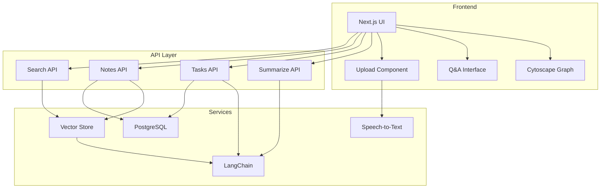
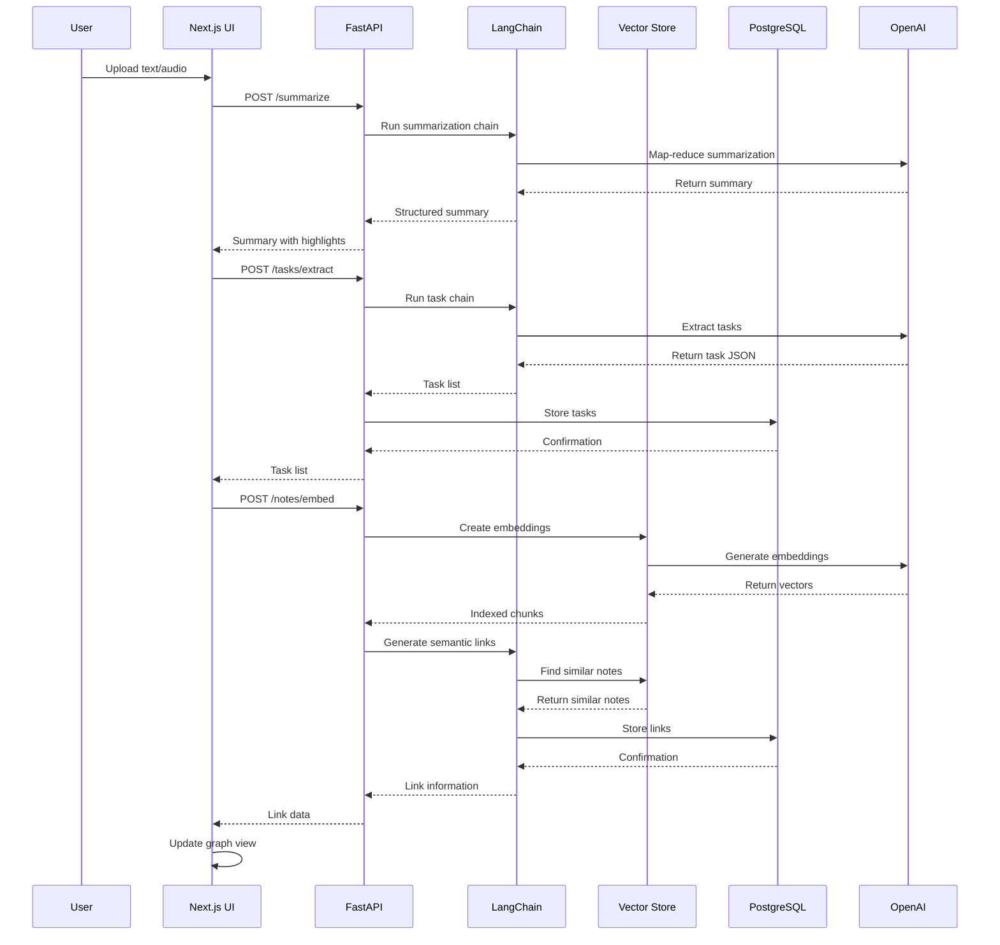

# AI Second Brain

An AI-powered personal knowledge system that summarizes meetings, extracts tasks, links notes via a semantic graph, and supports semantic search/Q&A.

## Features

- **Text Summarization**: Automatically create concise summaries from meeting notes or long texts
- **Task Extraction**: Identify and extract actionable tasks from content
- **Semantic Linking**: Connect related notes through semantic similarity
- **Graph Visualization**: Visualize your knowledge network with interactive graphs
- **Semantic Search & Q&A**: Ask questions about your knowledge base with cited answers
- **Audio Transcription**: Convert audio recordings to text using Whisper API

## Tech Stack

### Backend

- **API Framework**: FastAPI with Pydantic v2
- **Database**: PostgreSQL with SQLAlchemy/SQLModel
- **LLM Integration**: LangChain orchestration
- **Vector Store**: Pinecone (with FAISS fallback)
- **Models**: OpenAI GPT-4o and text-embedding-3-small
- **Speech-to-Text**: OpenAI Whisper API
- **Migrations**: Alembic
- **Testing**: Pytest with LLM mocks
- **Quality**: Black, Ruff, isort, Mypy

### Frontend

- **Framework**: Next.js App Router with TypeScript
- **UI**: Tailwind CSS, Shadcn/ui components
- **Data Fetching**: React Query
- **Graph Visualization**: Cytoscape
- **Validation**: Zod
- **Animation**: Framer Motion

## Architecture



## Data Flow



## Environment Variables

### Backend

```
OPENAI_API_KEY=sk-xxxxx
OPENAI_MODEL=gpt-4o-mini
OPENAI_EMBEDDING_MODEL=text-embedding-3-small
PINECONE_API_KEY=
PINECONE_ENV=
PINECONE_INDEX=ai-second-brain
USE_FAISS_FALLBACK=true
DATABASE_URL=postgresql+psycopg://postgres:postgres@db:5432/aisecondbrain
WHISPER_USE_API=true
LANGCHAIN_TRACING_V2=false
LANGCHAIN_PROJECT=ai-second-brain
```

### Frontend

```
NEXT_PUBLIC_BACKEND_URL=http://localhost:8000
```

## Setup

### Prerequisites

- Docker and Docker Compose
- OpenAI API key (optional: Pinecone API key)

### Installation

1. Clone the repository
   ```bash
   git clone https://github.com/yourusername/ai-second-brain.git
   cd ai-second-brain
   ```

2. Create environment files
   ```bash
   cp backend/.env.example backend/.env
   cp frontend/.env.example frontend/.env
   ```

3. Update environment files with your API keys

4. Start the application
   ```bash
   make dev
   ```

## API Reference

### Summarization

```http
POST /summarize
Content-Type: application/json

{
  "text": "long text content to summarize"
}
```

Response:
```json
{
  "summary": "Concise summary",
  "highlights": ["Point 1", "Point 2"],
  "decisions": ["Decision 1"],
  "action_items": ["Task 1", "Task 2"]
}
```

### Task Extraction

```http
POST /tasks/extract
Content-Type: application/json

{
  "text": "text containing tasks",
  "source_note_id": "optional-uuid-of-source-note"
}
```

Response:
```json
{
  "tasks": [
    {
      "description": "Complete project proposal",
      "due_date": "2023-12-31T00:00:00Z",
      "owner": "John",
      "source_note_id": "note-uuid",
      "completed": false
    }
  ]
}
```

### Note Operations

```http
POST /notes/embed
Content-Type: application/json

{
  "note_id": "uuid-of-note",
  "text": "note content",
  "meta": {"optional": "metadata"}
}
```

Response:
```json
{
  "chunks_indexed": 5,
  "links": [
    {
      "source_note": "uuid-of-note",
      "target_note": "uuid-of-related-note",
      "similarity": 0.87
    }
  ]
}
```

### Search & Q&A

```http
POST /search/query
Content-Type: application/json

{
  "query": "What were the key decisions?",
  "k": 6
}
```

Response:
```json
{
  "answer": "The key decisions were to proceed with option A [note_id:uuid-1] and schedule follow-up meetings [note_id:uuid-2].",
  "citations": [
    {
      "note_id": "uuid-1",
      "snippet": "After thorough analysis, the team decided to proceed with option A due to..."
    },
    {
      "note_id": "uuid-2",
      "snippet": "Follow-up meetings need to be scheduled with stakeholders to..."
    }
  ]
}
```

## Why LangChain?

LangChain provides significant benefits for this project:

1. **Modular Architecture**: Simplifies composition of different LLM capabilities
2. **Chain Abstraction**: Map-reduce patterns for summarization, structured outputs for tasks
3. **Retrieval Augmentation**: Built-in support for vector stores and retrievers
4. **Observability**: LangSmith integration for debugging and monitoring
5. **Prompt Engineering**: Template management and versioning
6. **Adapters**: Consistent interface for different embedding/LLM providers

LangChain's orchestration layer creates a clean separation between business logic and model interaction, making the system more maintainable and adaptable to new models.

## Development

### Common Commands

```bash
# Start development environment
make dev

# Rebuild containers
make dev-build

# Format code
make fmt

# Run linters
make lint

# Run tests
make test

# Run database migrations
make migrate

# Seed demo data
make seed

# Clean temporary files
make clean
```

## License

MIT
