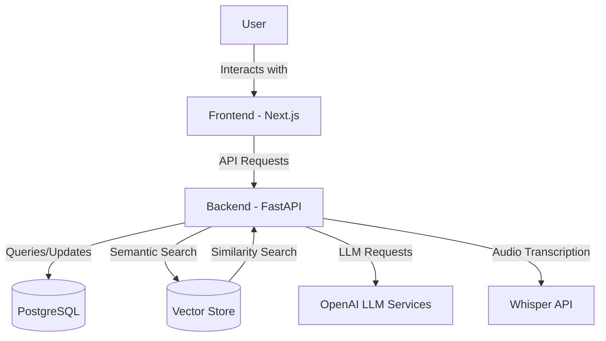
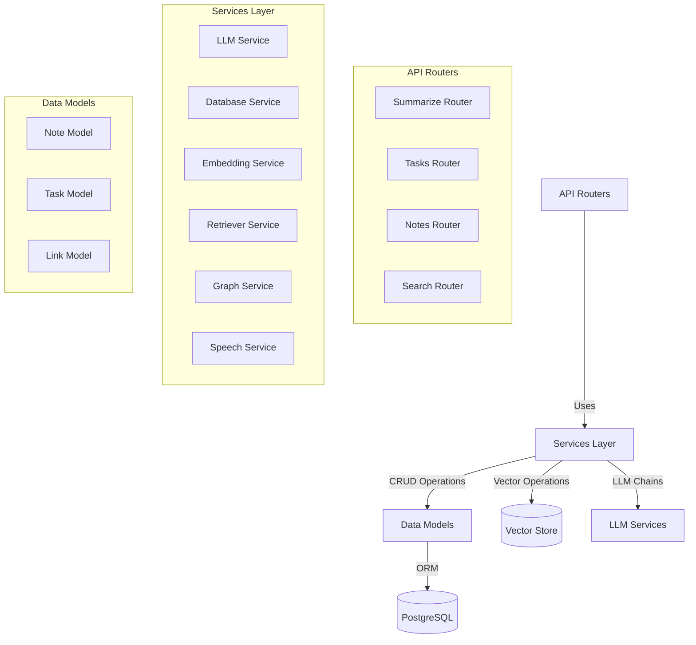
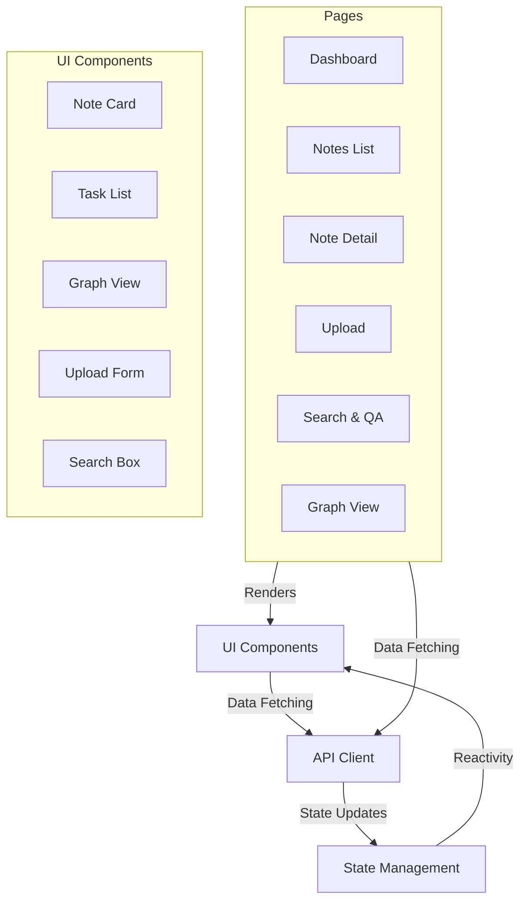
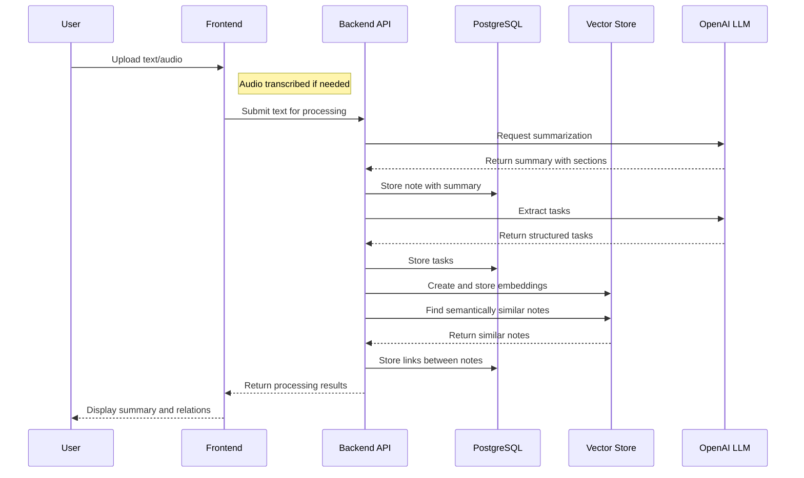
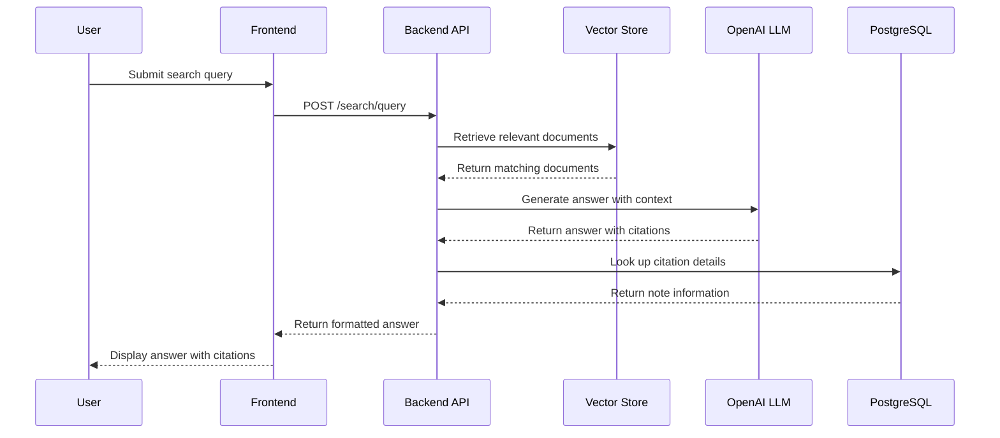
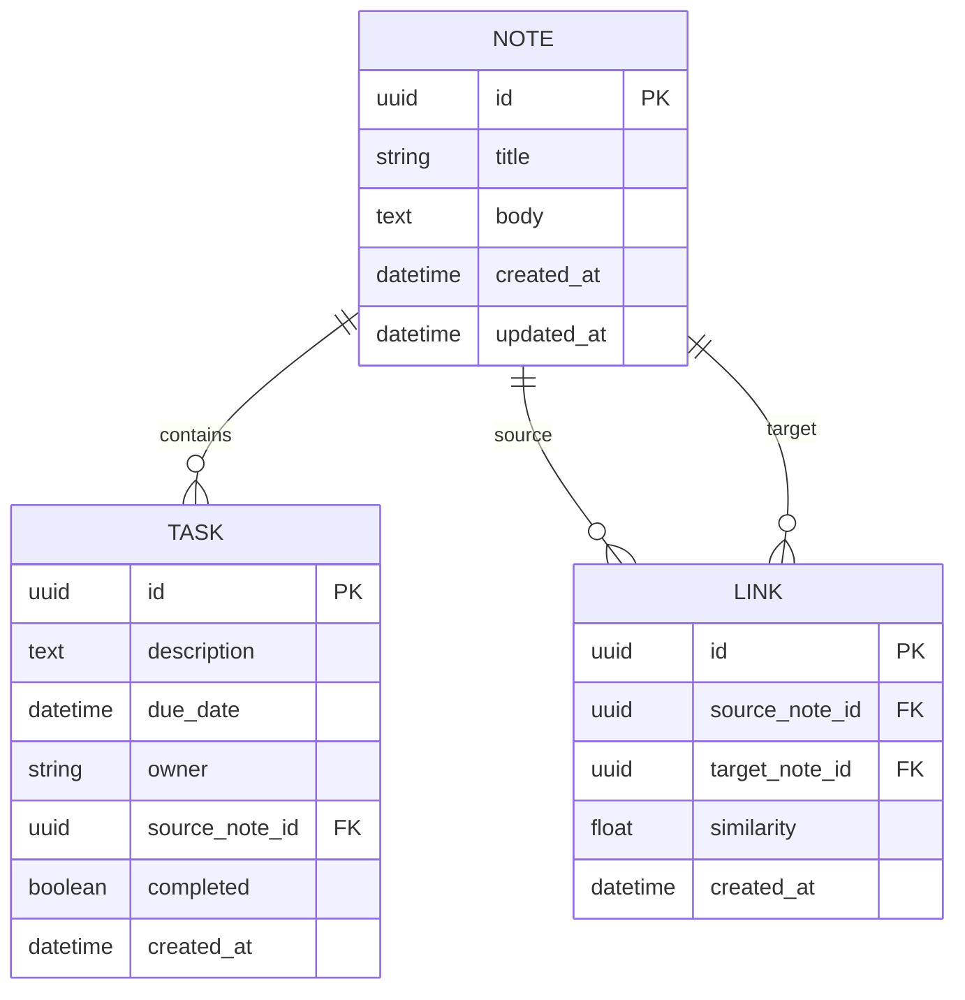

# AI Second Brain - Architecture Documentation

## System Overview

AI Second Brain is a knowledge management system that uses AI to process, organize, and retrieve information. The system is designed to help users capture, connect, and query their personal knowledge base.

## Component Architecture

### High-Level Components

### Backend Architecture

### Frontend Architecture

## Data Flow

### Note Processing Pipeline

### Search & Query Pipeline

## Database Schema

## Vector Storage

The system uses a vector database to store and query embeddings of note content. Two implementations are supported:

1. **Pinecone**: Primary vector store for production use
   - Scalable cloud-based vector database
   - Efficient similarity search
   - Persistence across sessions

2. **FAISS**: Local fallback option
   - In-memory vector store
   - No external API dependencies
   - Suitable for development and testing

The system automatically detects whether Pinecone credentials are available and falls back to FAISS if needed.

## LangChain Integration

LangChain is used as the orchestration layer for all LLM operations. Key components include:

1. **Summarization Chain**: Map-reduce pattern for processing long documents
2. **Task Extraction Chain**: Structured output with JSON schema enforcement
3. **Q&A Chain**: Retrieval augmented generation with citation tracking
4. **Embeddings**: Integration with OpenAI embedding models

## Security Considerations

1. API keys stored in environment variables, not in code
2. Backend handles all LLM API calls, frontend never directly accesses OpenAI
3. Database credentials isolated in containers
4. Rate limiting recommended for production deployments

## Scalability

1. Stateless API design allows horizontal scaling
2. Database can be scaled independently
3. Vector store (Pinecone) handles scaling of embedding storage and retrieval
4. Consider caching for frequently accessed notes and summaries

## Deployment Considerations

1. Ensure sufficient memory for FAISS if used (at least 4GB recommended)
2. Monitor OpenAI API usage to control costs
3. Consider adding Redis for rate limiting and caching in production
4. Set up proper monitoring for API endpoints and LLM service health
